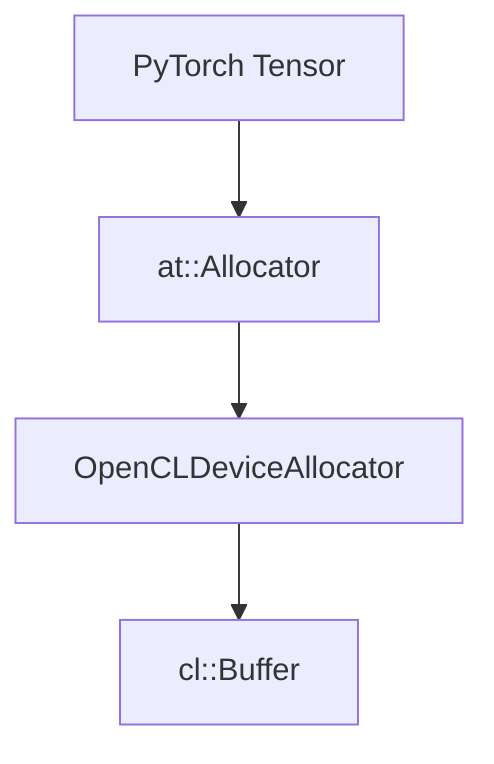
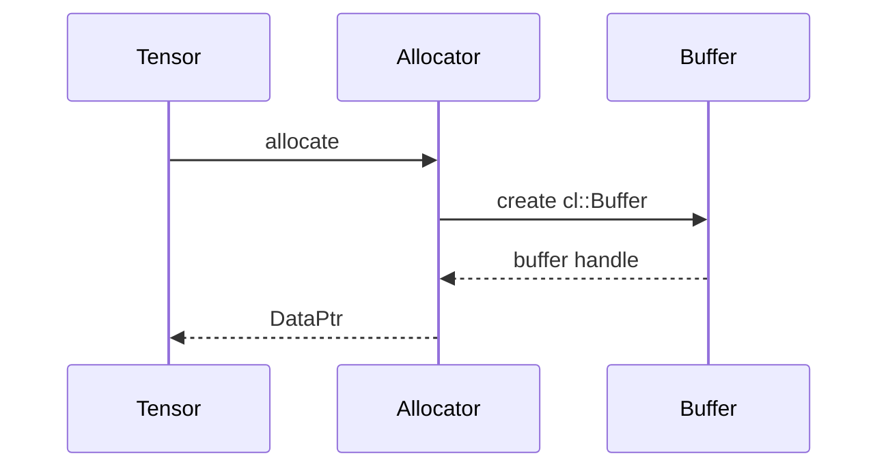

# Allocator Design

## Tujuan

Menghubungkan allocator PyTorch dengan memory OpenCL.

## Arsitektur Allocator



## Masalah Utama

PyTorch menggunakan model:

```cpp
void*
```

Sedangkan OpenCL menggunakan object:

```cpp
cl::Buffer
```

Karena itu backend memerlukan wrapper internal.

## Buffer Wrapper

```cpp
struct BufferEntry {
    cl::Buffer buffer;
    size_t size;
    int device;
};
```

## Lifecycle



## Release Strategy

Ketika reference tensor habis:

- DataPtr destructor dipanggil
- cl::Buffer direlease
- memory GPU dibebaskan
