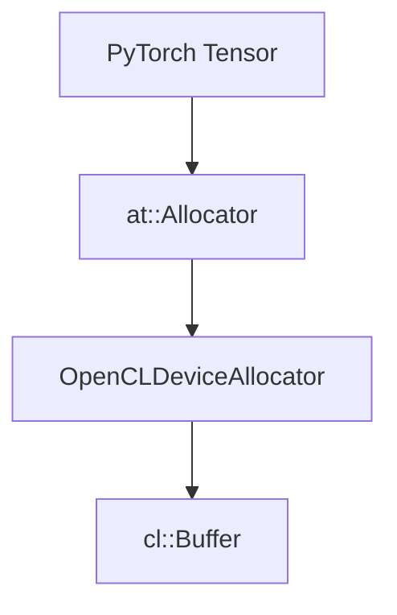
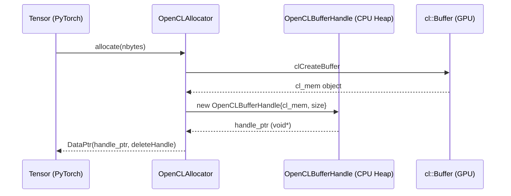

# Allocator Design: PyTorch OpenCL Backend

## Purpose

Tujuan utama dari desain ini adalah menghubungkan sistem alokasi memori
PyTorch yang berbasis pointer (`void*`) dengan model manajemen memori
berbasis objek pada OpenCL.

## Allocator Architecture

Sistem ini bertindak sebagai jembatan antara abstraksi tensor PyTorch dan
runtime OpenCL melalui slot `at::kPrivateUse1`.



## Primary Challenge: Memory Model Impedance

PyTorch didesain untuk bekerja dengan **Raw Pointers (`void*`)**, yang
merepresentasikan alamat memori virtual linier. Sebaliknya, OpenCL
menggunakan model **Opaque Object (`cl::Buffer`)** yang dikelola oleh
runtime dan tidak diekspos sebagai alamat memori mentah ke host.

### Solution: Pointer-to-Handle Indirection

Untuk menjembatani perbedaan ini, `OpenCLDeviceAllocator` tidak memberikan
pointer GPU langsung ke PyTorch. Alokasi dilakukan dalam dua tingkat:

- **Device Memory:** Alokasi nyata di GPU melalui objek `cl::Buffer`.
- **Host Memory (Heap):** Alokasi struktur pembungkus `OpenCLBufferHandle`
  di CPU heap.

`at::DataPtr` menyimpan alamat memori dari **struct handle** di CPU. Saat
eksekusi kernel, backend melakukan casting balik dari `void*` ke
`OpenCLBufferHandle*` untuk mendapatkan objek `cl::Buffer` asli.

## Buffer Wrapper

Struktur ini hidup di Host Heap dan berfungsi sebagai pemegang metadata
serta pemilik (_owner_) dari buffer OpenCL.

```cpp
struct OpenCLBufferHandle {
    cl::Buffer buffer;
    c10::DeviceIndex device;
    size_t size;
};

```

## Lifecycle

Proses alokasi memastikan bahwa setiap tensor memiliki akses ke memori GPU
melalui handle yang valid di sisi host.



## Implementation Strategies

Berdasarkan kendala runtime OpenCL dan integrasi PyTorch, allocator ini
menerapkan aturan khusus:

- **Zero-Byte Allocation:** OpenCL melarang alokasi 0 byte. Allocator
  memaksa ukuran minimal **1-byte** untuk mendukung tensor kosong.
- **Device Guard:** Menggunakan `VirtualGuardImpl` untuk memastikan
  alokasi terjadi pada konteks device yang aktif.

## Release Strategy

Manajemen memori otomatis melalui mekanisme Smart Pointer PyTorch:

- Saat _reference count_ nol, destruktor `at::DataPtr` dipanggil.
- `DataPtr` mengeksekusi fungsi deleter kustom `deleteHandle`.
- Fungsi melakukan `static_cast` dan `delete` pada `OpenCLBufferHandle`.
- Destruktor `cl::Buffer` memicu `clReleaseMemObject` secara otomatis.

## Known Limitations

- **Direct Allocation:** Belum ada Caching Pool. Setiap alokasi bersifat
  sinkron ke driver (overhead performa).
- **Shallow Copy:** `copy_data` hanya menyalin struktur handle, bukan
  transfer data fisik antar buffer GPU.
- **Non-Dereferenceable:** Pointer `void*` merujuk pada CPU Heap, tidak
  bisa di-dereference langsung untuk akses data GPU.
