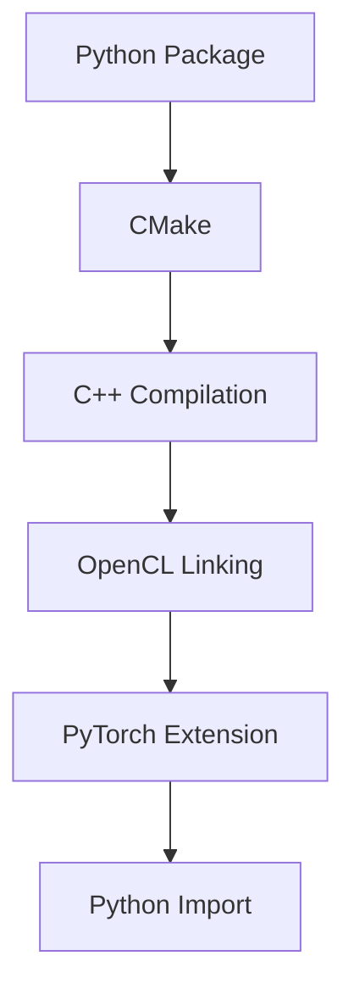

# Build Pipeline

## Build Architecture

## Komponen Build

### CMake

Digunakan untuk:

- compile backend
- link OpenCL
- setup include path

### Conan

Dependency manager untuk:

- OpenCL headers
- helper library

### PyTorch Extension

Digunakan agar extension dapat di-load langsung dari Python.

## Output

Build menghasilkan:

- shared library (`.so` / `.pyd`)
- Python package
