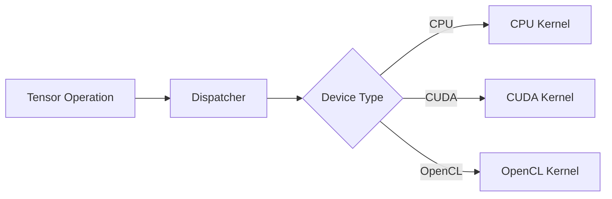

# Dispatcher Integration

## PrivateUse1

Backend menggunakan slot backend:

```cpp
PrivateUse1
```

yang disediakan oleh PyTorch.

## Registrasi Backend

```python
rename_privateuse1_backend("opencl")
```

## Dispatch Flow



## Operator Registration

Operator didaftarkan menggunakan:

- `TORCH_LIBRARY`
- `TORCH_LIBRARY_IMPL`

## Device Guard

Backend juga memerlukan:

- device guard
- stream handling
- synchronization primitive
