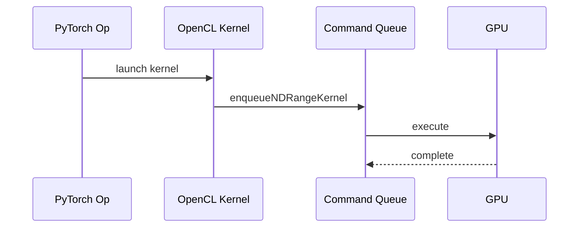

# Kernel Execution

## Pipeline Eksekusi

## Kernel Lifecycle

1. Build source OpenCL
2. Compile kernel
3. Create kernel object
4. Bind tensor buffers
5. Dispatch NDRange

## Buffer Binding

Tensor storage diterjemahkan menjadi:

- input buffer
- output buffer
- scalar arguments

## Synchronization Model

OpenCL backend menggunakan:

- blocking transfer
- explicit queue synchronization
- event-based execution
