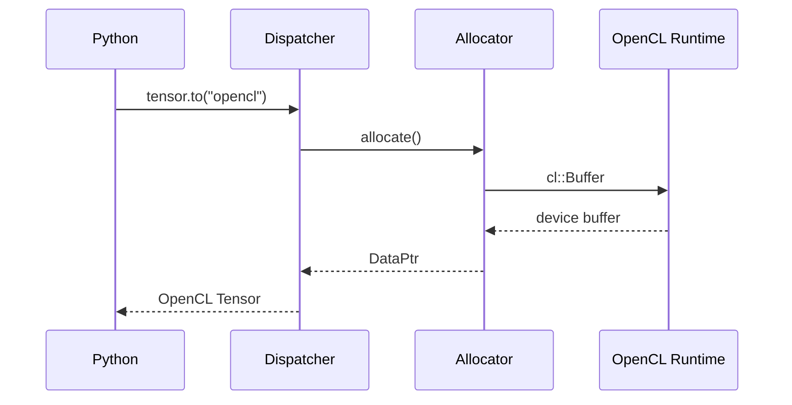

# Runtime Flow

## Flow Tensor Creation

## Tahapan Runtime

### 1. Tensor Dispatch

Ketika tensor dipindahkan ke device `opencl`,
dispatcher PyTorch mencari kernel dan allocator
yang sesuai untuk backend `PrivateUse1`.

### 2. Memory Allocation

Allocator membuat `cl::Buffer`
menggunakan context aktif.

### 3. Tensor Storage Binding

Buffer kemudian dibungkus menjadi `at::DataPtr`
agar kompatibel dengan storage system PyTorch.

### 4. Kernel Execution

Operator tensor akan memanggil implementasi backend OpenCL.

## Synchronization

Backend menggunakan command queue OpenCL
untuk sinkronisasi operasi.

