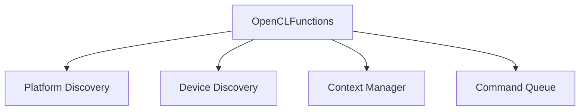
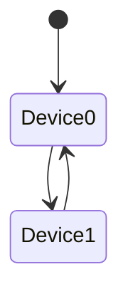

# Runtime Layer

## Tanggung Jawab Runtime

Runtime layer menjadi abstraction utama
antara PyTorch dan OpenCL runtime API.

## Arsitektur Runtime

## Device Discovery

Runtime melakukan enumerasi:

- OpenCL platform
- GPU devices
- CPU fallback devices

## Context Management

Setiap device memiliki:

- `cl::Context`
- `cl::CommandQueue`

Context biasanya diinisialisasi sekali
menggunakan lazy singleton pattern.

## Thread Safety

Runtime menggunakan:

- `std::mutex`
- `c10::call_once`
- thread local current device

untuk menjaga konsistensi state.

## Device Switching

