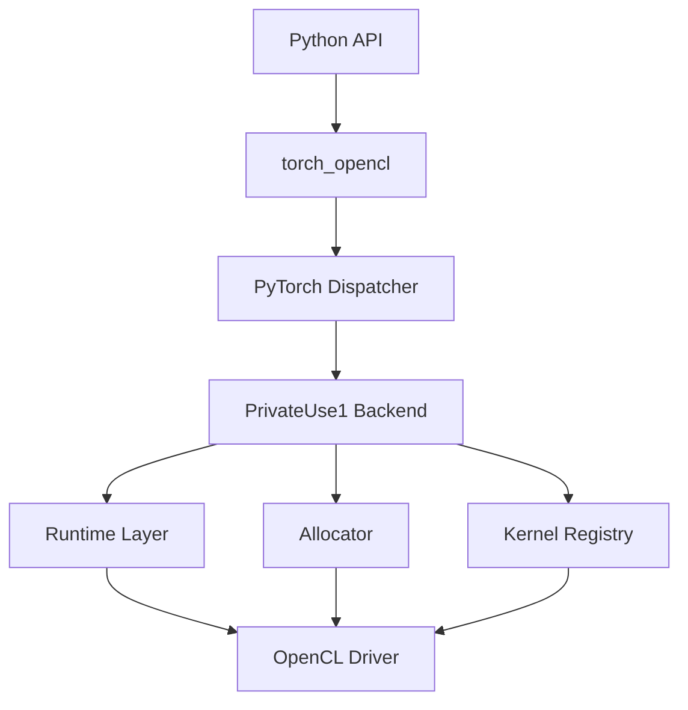

# System Overview

## High Level Architecture



## Tujuan Backend

Project ini menyediakan backend OpenCL agar PyTorch dapat menjalankan operasi tensor
di GPU/device yang mendukung OpenCL tanpa bergantung pada CUDA.

## Komponen Utama

### Python Layer

Layer Python bertanggung jawab untuk:

- inisialisasi extension
- registrasi backend
- expose API helper

### Dispatcher Layer

PyTorch dispatcher menentukan implementasi operator
berdasarkan device type tensor.

### Runtime Layer

Runtime mengelola:

- OpenCL platform
- device enumeration
- command queue
- synchronization

### Allocator Layer

Allocator bertugas menerjemahkan memory model PyTorch
ke `cl::Buffer`.

## Struktur Folder

```text
csrc/
├── aten/
├── runtime/
├── kernels/
└── _C.cpp

torch_opencl/
├── __init__.py
└── opencl/
```
