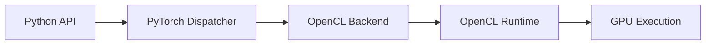
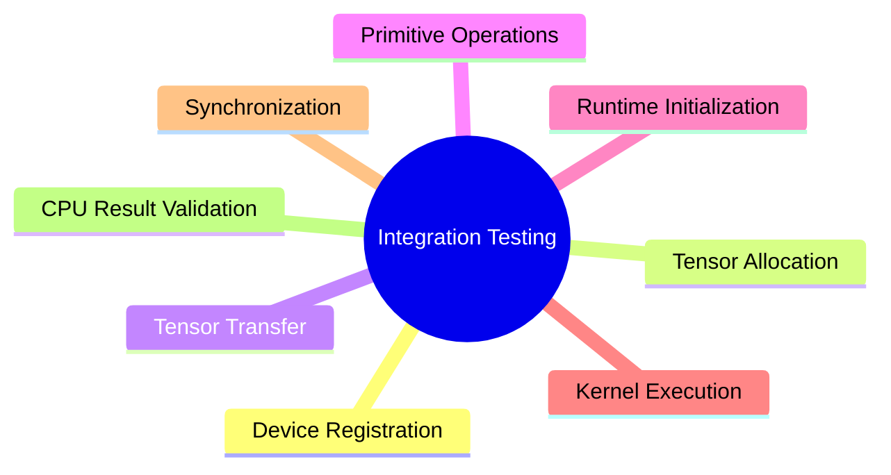
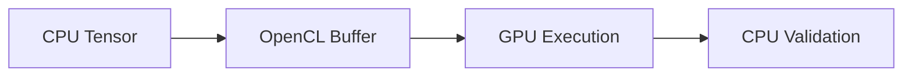
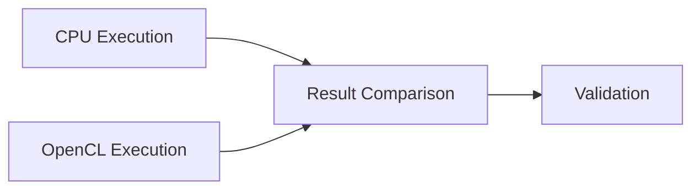
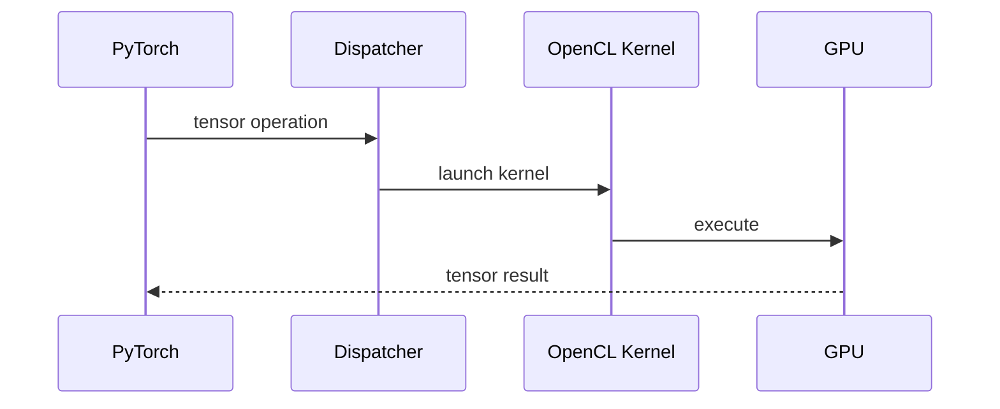
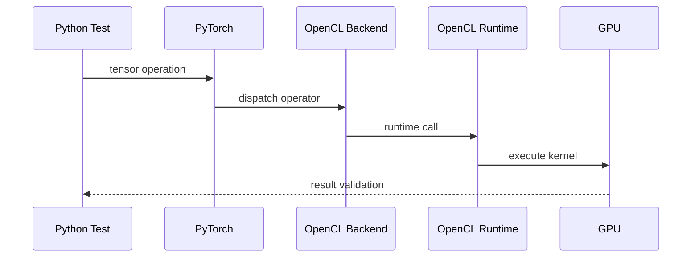

# Testing Strategy

## Pendekatan Testing

Project `torch-opencl` menggunakan pendekatan
**integration testing only**.

Sebagian besar komponen backend tidak dapat divalidasi
secara terisolasi karena seluruh sistem memiliki keterkaitan
yang sangat erat dengan runtime PyTorch dan runtime OpenCL.
Allocator bergantung pada context OpenCL aktif,
dispatcher bergantung pada sistem registrasi backend PyTorch,
dan eksekusi kernel memerlukan command queue serta device yang valid.

Karena itu pengujian dilakukan secara end-to-end
agar seluruh pipeline backend dapat divalidasi
dalam kondisi runtime yang sebenarnya.

## Filosofi Testing

Testing dilakukan dengan memastikan seluruh alur backend
berjalan dari level Python hingga eksekusi aktual di device OpenCL.
Pendekatan ini memungkinkan validasi yang lebih realistis
dibandingkan unit test terisolasi,
karena seluruh komponen runtime benar-benar digunakan
selama proses pengujian berlangsung.

## Fokus Pengujian

Fokus utama testing adalah memastikan backend mampu
menjalankan operasi tensor secara stabil dan menghasilkan
perilaku yang konsisten dengan backend CPU.

Pengujian mencakup validasi registrasi device,
alokasi tensor,
transfer data antar device,
inisialisasi runtime OpenCL,
eksekusi kernel,
sinkronisasi queue,
serta validasi numerik hasil komputasi.

## Device Registration Validation

Tahap awal testing memastikan backend `opencl`
berhasil diregistrasi ke dispatcher PyTorch.
Validasi ini penting karena seluruh sistem backend
bergantung pada kemampuan dispatcher
untuk mengenali device custom yang digunakan.

Testing memastikan extension dapat dimuat,
runtime dapat diinisialisasi,
dan device `opencl`
dapat digunakan secara langsung dari Python API.

## Tensor Allocation Validation

Testing allocator dilakukan dengan memastikan tensor
dapat dibuat secara valid pada device OpenCL
dan memiliki storage yang konsisten selama lifecycle tensor berlangsung.

Pengujian ini memvalidasi hubungan antara allocator backend,
OpenCL buffer,
dan sistem storage tensor milik PyTorch.
Selain memastikan tensor dapat dialokasikan,
testing juga memastikan memory dapat direlease dengan benar
dan tidak menghasilkan corruption selama penggunaan runtime.

## Tensor Transfer Validation

Transfer tensor menjadi bagian penting dalam backend OpenCL
karena melibatkan sinkronisasi antara memory host dan device.

Testing memastikan data dapat dipindahkan
dari CPU ke OpenCL dan kembali lagi ke CPU
tanpa perubahan shape,
dtype,
atau kerusakan data.

Validasi transfer juga memastikan command queue
dan runtime synchronization berjalan secara konsisten.

## Validasi Operasi Primitif

Pengujian backend difokuskan pada berbagai pola operasi tensor
yang menjadi fondasi utama komputasi di PyTorch.

Testing mencakup operasi aritmatika tensor,
broadcasting,
transformasi data,
operasi unary,
operasi reduksi,
dan berbagai bentuk manipulasi tensor lain
yang umum digunakan selama runtime berlangsung.

Dokumentasi ini tidak mencantumkan seluruh operator secara spesifik
karena jumlah operator PyTorch sangat besar dan terus berkembang.
Sebagai gantinya,
pengujian difokuskan pada representasi kategori operasi inti
yang paling sering digunakan oleh dispatcher dan runtime tensor.

Tujuan utama validasi ini adalah memastikan dispatcher
meroute operator dengan benar,
kernel OpenCL menghasilkan output valid,
allocator tetap stabil selama eksekusi,
dan seluruh hasil komputasi tetap konsisten
terhadap reference CPU.

## Validasi Hasil Komputasi

Seluruh hasil komputasi backend OpenCL
dibandingkan dengan hasil komputasi CPU
sebagai reference utama.

Karena floating point computation dapat menghasilkan
perbedaan kecil antar hardware dan backend,
validasi dilakukan menggunakan pendekatan approximate comparison.

Testing tidak mengharapkan hasil bit-perfect,
melainkan memastikan error numerik tetap berada
dalam toleransi floating point yang dapat diterima.

Pendekatan ini penting karena implementasi floating point GPU,
optimisasi compiler OpenCL,
dan precision antar device
dapat menghasilkan variasi numerik kecil
meskipun operasi yang dijalankan identik.

## Runtime Initialization Validation

Runtime OpenCL divalidasi melalui proses
platform discovery,
device enumeration,
context initialization,
dan command queue creation.

Testing memastikan runtime mampu menjalankan
pipeline tensor secara penuh
tanpa dependency mocking.

Selain validasi inisialisasi,
pengujian juga memastikan runtime mampu
mempertahankan context valid,
mengelola queue secara stabil,
dan menjalankan operasi tensor berulang
tanpa menyebabkan runtime corruption.

## Kernel Execution Validation

Testing memastikan kernel OpenCL
dapat dikompilasi,
menerima argument tensor dengan benar,
dan dieksekusi menggunakan command queue aktif.

Pengujian dilakukan terhadap berbagai ukuran tensor
untuk memastikan backend tetap stabil
pada workload kecil maupun besar.

Validasi ini juga memastikan hasil tensor
memiliki shape,
dtype,
dan isi data yang sesuai setelah eksekusi kernel selesai.

## Synchronization Validation

Backend OpenCL menggunakan asynchronous execution model,
sehingga sinkronisasi runtime menjadi bagian penting
dalam proses testing.

Pengujian memastikan operasi asynchronous selesai
sebelum tensor digunakan kembali oleh runtime atau CPU.

Testing juga memastikan queue tetap konsisten,
transfer data tersinkronisasi dengan benar,
dan tidak terjadi race condition
yang dapat menyebabkan corruption atau invalid tensor state.

## Stability Validation

Selain validasi fungsional,
testing juga difokuskan pada stabilitas runtime jangka panjang.

Pengujian dilakukan melalui repeated tensor allocation,
repeated kernel execution,
large tensor workload,
dan berbagai pola penggunaan runtime lain
yang dapat memicu memory leak atau runtime instability.

Tujuan utama tahap ini adalah memastikan backend
mampu mempertahankan konsistensi state runtime
selama penggunaan berulang.

## Kenapa Tidak Menggunakan Unit Test

Sebagian besar komponen backend tidak dapat dipisahkan
menjadi unit independen karena seluruh sistem
memiliki dependency runtime yang saling terhubung.

Allocator membutuhkan OpenCL context aktif,
dispatcher membutuhkan registrasi backend PyTorch,
dan kernel execution membutuhkan command queue valid.

Mocking seluruh stack tersebut justru menghasilkan test
yang tidak merepresentasikan kondisi runtime sebenarnya.

Karena itu integration testing menjadi metode
yang paling realistis dan paling akurat
untuk memvalidasi backend OpenCL.

## Alur Integration Test

Diagram di atas menggambarkan bagaimana testing dilakukan
langsung melalui runtime PyTorch aktual
hingga eksekusi nyata di GPU OpenCL.

Pendekatan ini memastikan seluruh pipeline backend
dapat divalidasi secara menyeluruh
dalam kondisi penggunaan yang sebenarnya.
