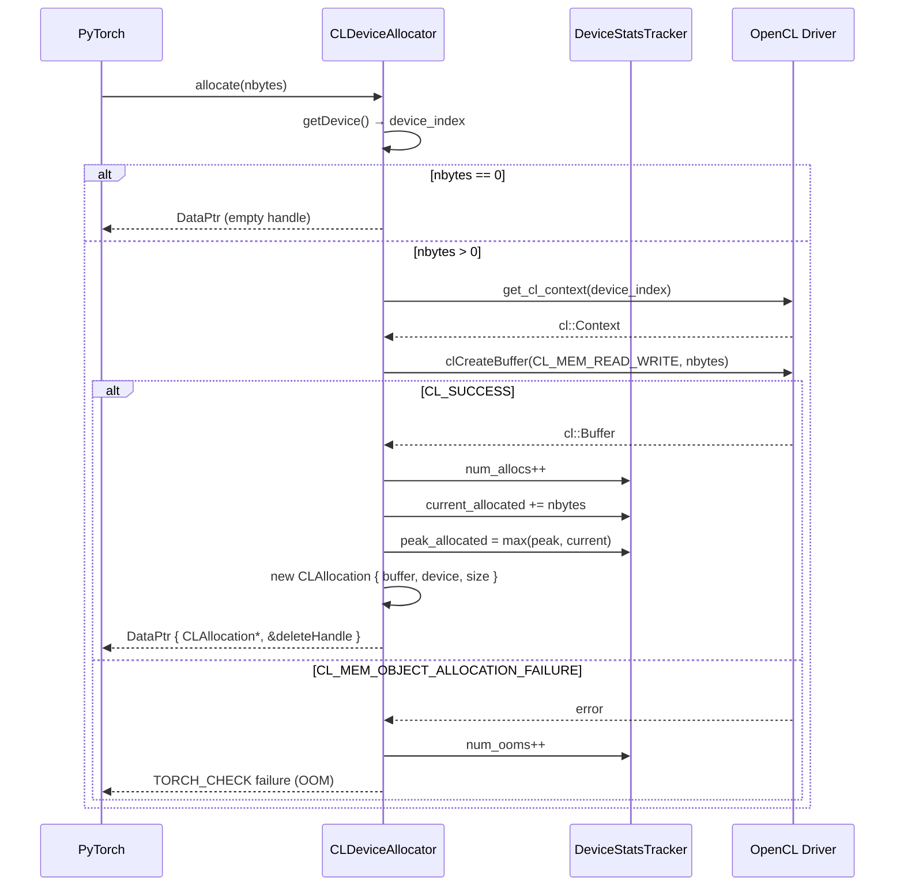
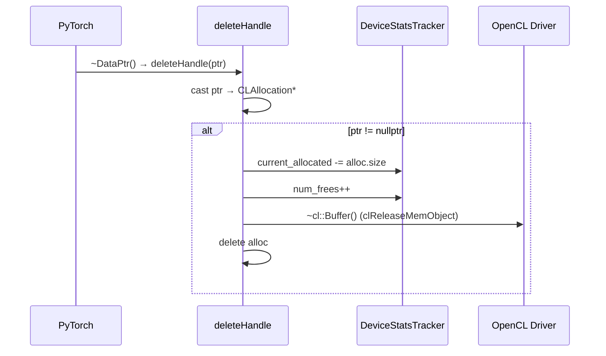

# Device Allocator

## Background

`CLDeviceAllocator` adalah implementasi `c10::DeviceAllocator` untuk backend OpenCL pada PyTorch. Allocator ini mengelola siklus hidup buffer OpenCL (`cl::Buffer`) yang digunakan sebagai backing memory untuk tensor pada device OpenCL (`kPrivateUse1`). Setiap alokasi dibungkus dalam struct `CLAllocation` yang menyimpan buffer, indeks device, dan ukuran, lalu disimpan sebagai opaque pointer di dalam `at::DataPtr`.

Statistik memori per-device (`current_allocated`, `peak_allocated`, `num_allocs`, `num_frees`, `num_ooms`) dilacak secara internal melalui `DeviceStatsTracker`. Tracker diinisialisasi secara lazy pada panggilan pertama sesuai jumlah device OpenCL yang terdeteksi.

Allocator didaftarkan secara otomatis ke PyTorch saat library dimuat melalui mekanisme static initializer (`at::SetAllocator`). Command queue bersifat sinkron — `queue.finish()` dipanggil secara eksplisit untuk menjamin urutan operasi, sehingga fitur seperti stream recording dan caching layer belum diimplementasikan (no-op).

## Design

### CLAllocation

Setiap alokasi memori direpresentasikan oleh struct `CLAllocation` yang berisi tiga field:

| Field    | Tipe               | Keterangan                         |
| -------- | ------------------ | ---------------------------------- |
| `buffer` | `cl::Buffer`       | Buffer OpenCL yang dialokasikan    |
| `device` | `c10::DeviceIndex` | Indeks device tempat buffer berada |
| `size`   | `size_t`           | Ukuran alokasi dalam byte          |

Instance `CLAllocation` disimpan sebagai opaque pointer di dalam `DataPtr` PyTorch dan dibebaskan oleh fungsi `deleteHandle` saat tensor dihancurkan.

### Statistik Memori

Tracking statistik dilakukan per-device melalui `DeviceStatsTracker`. Karena tidak ada caching layer, nilai `reserved_bytes` diisi sama dengan `allocated_bytes`. Peak usage dapat direset secara independen dari statistik kumulatif menggunakan `resetPeakStats()`.

| Field Tracker       | Keterangan                     |
| ------------------- | ------------------------------ |
| `current_allocated` | Byte yang sedang dialokasikan  |
| `peak_allocated`    | Puncak alokasi sepanjang waktu |
| `num_allocs`        | Jumlah alokasi kumulatif       |
| `num_frees`         | Jumlah pembebasan kumulatif    |
| `num_ooms`          | Jumlah kegagalan akibat OOM    |

### Method Reference

| Method                  | Deskripsi                                                                                           | Skenario Penggunaan                                 |
| ----------------------- | --------------------------------------------------------------------------------------------------- | --------------------------------------------------- |
| `allocate`              | Alokasi `cl::Buffer` di device aktif; jika `nbytes == 0` mengembalikan handle kosong.               | `torch.empty()`, `torch.zeros()`, `.to(device)`     |
| `raw_deleter`           | Mengembalikan pointer ke `deleteHandle` sebagai deleter `DataPtr`.                                  | Dipanggil internal saat `DataPtr` dihancurkan.      |
| `copy_data`             | Salin sinkron antar buffer OpenCL dalam satu device via `clEnqueueCopyBuffer` + `queue.finish()`.   | `tensor.clone()` dan operasi salin buffer internal. |
| `initialized`           | Mengembalikan `true` jika `device_count() > 0`.                                                     | Gating check saat inisialisasi backend PyTorch.     |
| `emptyCache`            | No-op; belum ada caching layer.                                                                     | `torch.opencl.empty_cache()`                        |
| `recordStream`          | No-op; queue bersifat sinkron.                                                                      | Relevan bila multi-stream diimplementasikan.        |
| `getDeviceStats`        | Mengembalikan `DeviceStats` dari tracker internal (`allocated`, `peak`, `allocs`, `frees`, `ooms`). | `torch.opencl.memory_stats()`, profiling tools.     |
| `resetAccumulatedStats` | Reset `num_allocs` dan `num_frees` ke nol.                                                          | Sebelum memulai sesi profiling baru.                |
| `resetPeakStats`        | Reset `peak_allocated` ke `current_allocated`.                                                      | Sebelum bagian kode yang ingin diprofilkan.         |

> **Catatan:** `emptyCache()` dan `recordStream()` adalah no-op karena caching dan multi-stream belum diimplementasikan. Peer-to-peer copy antar device tidak didukung.

## Implementasi

### allocate

### raw_deleter

